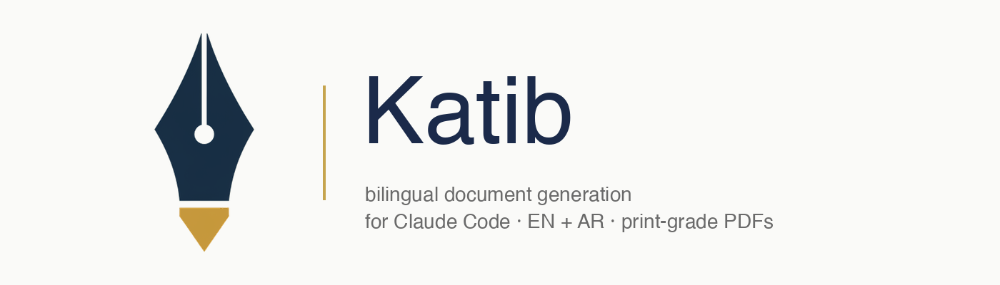

<p align="center">
  
</p>

<p align="center">
  <b>Bilingual (EN + AR) print-grade PDF document generation for Claude Code.</b><br>
  <a href="https://www.npmjs.com/package/@jasemal/katib"></a>
  <a href="LICENSE"></a>
  
</p>

One skill, two languages, multiple document domains, pluggable cover + layout
styles, per-project brand profiles. HTML + CSS → WeasyPrint → PDF.

Invoked with `/katib` inside any Claude Code conversation.

> **كاتب** (*kātib*, "the writer") — the one who shapes words onto paper.

---

## What it does

| | |
|---|---|
| **Domains** | `business-proposal`, `tutorial`, `report`, `formal`, `personal` |
| **Doc types** | Proposal, one-pager, letter · how-to, onboarding, tutorial, handoff, cheatsheet · research-report, progress-report, annual-report, audit-report · NOC, government-letter, circular, authority-letter · CV, cover-letter, bio |
| **Languages** | English (LTR) and Arabic (RTL, MSA + خليجي) as peer templates — not machine translation |
| **Output** | Print-grade PDF via WeasyPrint |
| **Covers** | Minimalist CSS (no API key), Gemini neural-cartography, Gemini friendly-illustration |
| **Interiors** | `classic`, `workbook` |
| **Brand profiles** | Per-client YAML — colors, fonts, logo, identity; bilingual fallback baked in |
| **Diagrams** | Inline SVG with brand-color tokenization (no external diagram tools) |
| **Screenshots** | Playwright capture + Pillow annotation + CSS frames — bilingual alt/caption bundles |
| **Fonts** | Katib declares 4 core families (Newsreader, Inter, Amiri, Cairo). Install them once — see [Fonts](#fonts) below. |

---

## Requirements

| | |
|---|---|
| **OS** | macOS · Linux · Windows via WSL2 (native Windows unsupported — see note below) |
| **Python** | 3.11 or newer |
| **uv** | any recent version — installer will install it if missing |
| **System libs** | Pango, Cairo, GDK-Pixbuf (for WeasyPrint) |
| **Gemini API key** | *optional* — only for image-based covers. `minimalist-typographic` works without it. |

### System library install, per OS

| OS | Command |
|---|---|
| macOS | `brew install pango cairo gdk-pixbuf libffi` |
| Debian / Ubuntu | `sudo apt install libpango-1.0-0 libpangoft2-1.0-0 libcairo2 libgdk-pixbuf-2.0-0 libffi-dev` |
| Fedora | `sudo dnf install pango cairo gdk-pixbuf2 libffi-devel` |
| Arch | `sudo pacman -S pango cairo gdk-pixbuf2 libffi` |
| Windows | Use [WSL2 with Ubuntu](https://learn.microsoft.com/en-us/windows/wsl/install), then follow the Debian/Ubuntu row |

Why no native Windows? WeasyPrint on native Windows needs the GTK3 runtime and
is historically fragile. WSL2 is the reliable path and it's what most Claude
Code users on Windows already have.

---

## Install

**Recommended** — via npx (no cloning, always latest):

```bash
npx @jasemal/katib
```

That's it. The wrapper runs the installer under the hood — no global install, no lockfiles, re-run any time to update.

**Other installers**:

```bash
# curl + bash (no Node required)
curl -fsSL https://raw.githubusercontent.com/jneaimi/katib/main/install.sh | bash

# or clone and run
git clone https://github.com/jneaimi/katib.git && cd katib && bash install.sh
```

The installer:
1. Checks prereqs (git, Python 3.11+, uv, WeasyPrint libs)
2. Clones to `~/.claude/skills/katib/` — or pulls if already installed
3. Runs `uv run playwright install chromium` for the screenshot module
4. Creates `~/.katib/brands/`, `~/.config/katib/`, `~/.local/share/katib/memory/`
5. Seeds a vault-aware `~/.config/katib/config.yaml`
6. Prompts for an optional Gemini API key and (with your OK) appends it to your shell rc

Re-run any time to update.

### npx commands

```bash
npx @jasemal/katib                    # install (or update if already installed)
npx @jasemal/katib update             # git pull the installed skill
npx @jasemal/katib uninstall          # remove the skill, keep user data
npx @jasemal/katib uninstall --purge  # also wipe ~/.katib, config, memory
npx @jasemal/katib version            # print the CLI version
npx @jasemal/katib help               # full usage
```

---

## First use

After install, restart Claude Code and type `/katib` in any conversation.

Or drive the build directly from the terminal:

```bash
cd ~/.claude/skills/katib

# Business proposal — English, Arabic, co-located via --slug
uv run scripts/build.py proposal --domain business-proposal --lang en --slug my-first-proposal
uv run scripts/build.py proposal --domain business-proposal --lang ar --slug my-first-proposal

# Tutorial — applies a specific brand + bundled layout
uv run scripts/build.py how-to --domain tutorial --lang en --brand example --layout workbook

# With a Gemini cover (needs GEMINI_API_KEY)
uv run scripts/build.py proposal --domain business-proposal --lang en \
  --cover neural-cartography --with-cover

# List installed brands
uv run scripts/build.py --list-brands
```

Generated folders land in:

- `~/vault/content/katib/<domain>/<date>-<slug>/` — if `~/vault/` exists (Obsidian users)
- `~/Documents/katib/<domain>/<date>-<slug>/` — otherwise

Override anywhere with `KATIB_OUTPUT_ROOT=/path/to/elsewhere`.

Each folder contains the PDF(s), a `manifest.md`, a `source/` copy of the rendered HTML, and a `.katib/run.json` with build metadata.

---

## Domains & doc types

Each doc type ships as EN + AR peer templates at
`domains/<domain>/templates/<type>.{en,ar}.html`.

| Domain | Doc type | Target pages | Ref prefix | When to reach for it |
|---|---|---|---|---|
| `business-proposal` | `proposal` | 8–15 | `PROP-*` | Full commercial offer — scope, timeline, investment, signature |
| | `one-pager` | 1 | `OP-*` | Executive summary, pitch, quick-decision doc |
| | `letter` | 1–2 | `LET-*` | Cover letter, formal correspondence, intent letter |
| `tutorial` | `how-to` | 2–6 | `HT-*` | A single task, one sitting |
| | `cheatsheet` | 1–2 | `CS-*` | Reference card, shortcuts, quick lookup |
| | `tutorial` | 5–15 | `TUT-*` | Multi-module learning path |
| | `onboarding` | 10–25 | `ON-*` | New-hire or new-role orientation |
| | `handoff` | 3–12 | `HT-*-###` | Transferring ownership, runbook |
| `report` | `research-report` | 10–30 | `RPT-R-*` | Original research or analysis with methodology + findings |
| | `progress-report` | 5–15 | `RPT-P-*` | Periodic status update — KPIs, milestones, risks |
| | `annual-report` | 20–60 | `RPT-A-*` | Year-end institutional review |
| | `audit-report` | 10–25 | `RPT-AU-*` | Compliance, security, or process audit |
| `formal` | `noc` | 1 | `NOC-*` | UAE No-Objection Certificate for visa / school / bank / travel |
| | `government-letter` | 1–2 | `GOV-*` | Submissions to ministries, authorities, regulators |
| | `circular` | 1–2 | `CIR-*` | Internal company-wide announcements |
| | `authority-letter` | 1 | `AUTH-*` | Delegation of a specific act (not full POA) |
| `personal` | `cv` | 1–2 | `CV-*` | Two-column CV with GCC fields (nationality, visa, photo, languages) |
| | `cover-letter` | 1 | `CL-*` | Three-paragraph role application with masthead |
| | `bio` | 1 | `BIO-*` | Speaker bio with short/medium/long variants |

Going over a doc type's `page_limit` fails the build (exit 3). Going below the
`target_pages` floor prints a warning but still ships. Both come from
`domains/<domain>/styles.json`.

Planned future domains — `academic` (syllabi, lecture notes),
`financial` (invoices), `editorial` (white papers), `marketing-print`
(sell-sheets, slide decks as PDF), `legal` (contracts, NDAs) — are
listed in the [Roadmap](#roadmap) and deferred in v0.4.

---

## Command reference

Every script is launched with `uv run scripts/<name>.py ...` from the skill
directory (`~/.claude/skills/katib/`). `uv` resolves the PEP-723 inline
dependencies on first run.

### `build.py` — render a document

```bash
uv run scripts/build.py <doc-type> [flags]
```

| Flag | Default | Purpose |
|---|---|---|
| `--domain <name>` | `business-proposal` | Which domain's templates to use |
| `--lang {en,ar}` | `en` | Render language |
| `--title <text>` | `"Sample Document"` | Title that appears on the cover |
| `--purpose <text>` | — | One-line purpose (used as the subtitle / manifest) |
| `--cover <style>` | domain default | `minimalist-typographic`, `friendly-illustration`, or `neural-cartography` |
| `--layout <variant>` | domain default | `classic` or `workbook` |
| `--project <name>` | `katib` | Project name recorded in `manifest.md` |
| `--ref <code>` | _(auto)_ | Reference code, e.g. `PROP-2026-001` |
| `--slug <slug>` | _(from title)_ | Custom folder slug — pass the **same** slug to EN + AR renders to co-locate them |
| `--brand <name>` | _(none)_ | Load a brand profile from `~/.katib/brands/<name>.yaml` or the shipped `brands/` dir |
| `--brand-file <path>` | _(none)_ | Load a brand profile from an explicit path |
| `--with-cover` | off | Generate `assets/cover.png` via Gemini Nano Banana 2 before render |
| `--force-cover` | off | Regenerate the cover even if one already exists (implies `--with-cover`) |
| `--check` | — | Lint CSS and templates only — no render |
| `--verify <folder>` | — | Verify an existing generation folder (page count, fonts, placeholders) |
| `--list-brands` | — | List available brand profiles (user + skill dirs) and exit |

**Environment variables**

| Var | Effect |
|---|---|
| `KATIB_OUTPUT_ROOT` | Override the output root (e.g., `/tmp/scratch`) — useful for testing |
| `KATIB_SLUG_OVERRIDE` | Force a specific slug for the next render |
| `KATIB_IMAGE_MODEL` | Override Gemini model for cover generation (default `nano-banana-2`) |
| `KATIB_CACHE_DIR` | Screenshot cache directory (default `~/.katib/cache/screenshots`) |
| `KATIB_DEBUG=1` | Verbose build output |
| `GEMINI_API_KEY` | Required only for image-based covers and cover-image regeneration |

### `cover.py` — generate a cover image (Gemini)

```bash
uv run scripts/cover.py --folder <generation-folder>  # writes assets/cover.png
uv run scripts/cover.py --out path/to/cover.png --style friendly-illustration
```

| Flag | Purpose |
|---|---|
| `--folder <path>` | Katib generation folder — writes to `<folder>/assets/cover.png` and respects its `manifest.md` cover style |
| `--out <path>` | Explicit output path (bypasses folder mode) |
| `--style <key>` | Cover style (default reads from the folder's manifest) |
| `--model <id>` | Override model (`nano-banana-2`, or any full Gemini model id) |
| `--aspect <ratio>` | Override aspect ratio (e.g., `2:3` for a portrait cover) |
| `--force` | Overwrite existing `cover.png` |
| `--dry-run` | Print the resolved prompt + config without calling the API |

### `shot.py` — capture a screenshot (tutorial domain)

```bash
uv run scripts/shot.py --url https://example.com --folder <generation-folder> --name step-1 \
  --hide "header.sticky,#cookie-banner" \
  --alt-en "Login page" --alt-ar "صفحة تسجيل الدخول" \
  --caption-en "The login form" --caption-ar "نموذج تسجيل الدخول"
```

Most-used flags (see `--help` for the full list — `shot.py` has ~20):

| Flag | Purpose |
|---|---|
| `--url <url>` | Page to capture (required) |
| `--folder <path>` / `--out <path>` | Save to a generation folder's `assets/screenshots/` or an explicit path |
| `--viewport {desktop,laptop,tablet,mobile,square}` | Preset viewport size |
| `--width / --height / --scale` | Custom size + device-scale factor (retina = 2.0) |
| `--full-page` | Capture the entire scrolling page |
| `--clip <css-selector>` | Capture only the bounding box of a single element |
| `--wait-for <selector>` / `--wait-ms <n>` | Wait for a selector or a fixed delay before capture |
| `--hide <selectors>` | Comma-separated CSS selectors to hide (sticky headers, cookie banners) |
| `--cookies <path>` | JSON cookies for authenticated pages |
| `--theme {light,dark}` | `prefers-color-scheme` |
| `--alt-en / --alt-ar / --caption-en / --caption-ar` | Bilingual alt + caption — `build.py` picks the right one per render language |
| `--site <name>` | Load defaults from `~/.katib/sites/<name>.json` (viewport, hide, cookies, theme) |
| `--force` / `--no-cache` / `--dry-run` | Re-capture, skip cache, or just print the resolved config + cache key |

Captures are content-addressed — identical inputs hit the cache
(`~/.katib/cache/screenshots/<hash>.png`) and skip Playwright (~50× faster).

### `annotate.py` — annotate a screenshot

```bash
uv run scripts/annotate.py assets/screenshots/step-1.png
```

Reads an annotation spec from `<image>.annot.json` (default) or `--spec <path>`.
DPI-aware: strokes and fonts scale with the source resolution.

Spec schema (callouts = numbered circles, arrows, blur rects):

```json
{
  "callouts": [
    {"x": 120, "y": 80, "label": "1"},
    {"x": 340, "y": 220, "label": "2"}
  ],
  "arrows": [
    {"from": [50, 400], "to": [210, 480]}
  ],
  "blurs": [
    {"x": 12, "y": 12, "w": 200, "h": 40}
  ]
}
```

| Flag | Purpose |
|---|---|
| `--spec <path>` | Explicit spec path (default `<image>.annot.json`) |
| `--out <path>` | Output PNG (default `<image>.annot.png`) |
| `--lang {en,ar}` | Affects label-side heuristics for RTL documents |
| `--force` / `--dry-run` | Overwrite existing output / validate spec only |

### `frame.py` — wrap a screenshot in chrome

```bash
uv run scripts/frame.py assets/screenshots/step-1.png --chrome mac --theme light
```

| Flag | Purpose |
|---|---|
| `--chrome {mac,generic,none}` | Frame style (default `mac`) |
| `--theme {light,dark}` | Chrome theme (default `light`) |
| `--url <url>` | URL shown in the URL bar (default reads from `<image>.meta.json`) |
| `--out <path>` / `--force` / `--dry-run` | Standard output controls |

### Test harnesses

```bash
bash scripts/test-all.sh          # business-proposal × 3 doc types × 2 langs = 6 renders
bash scripts/test-tutorial.sh     # tutorial × 5 doc types × 2 langs = 10 renders
bash scripts/test-brand.sh        # brand loader + end-to-end render (77 assertions)
bash scripts/test-alt-bundles.sh  # bilingual alt/caption resolution (18 assertions)
bash scripts/test-images.sh       # annotate + frame golden-image regression (8 goldens)
```

`test-images.sh` goldens are machine-local — regenerate with
`bash scripts/test-images.sh --regenerate` on a Pillow upgrade or host change.

---

## Brand profiles

A brand profile is a single YAML file that overrides colors, fonts, logo, and
author identity per project — without touching templates.

```yaml
# ~/.katib/brands/acme.yaml
name: ACME Corp
name_ar: شركة أكمي
legal_name: ACME Corp LLC

identity:
  author_name: Jane Doe
  email: jane@acme.example

colors:
  accent: "#1B2A4A"
  accent_2: "#C5A44E"
  accent_on: "#FFFFFF"

fonts:
  en: { primary: "Inter", display: "Newsreader" }
  ar: { primary: "IBM Plex Arabic" }

logo: ./logo.svg
```

Then: `--brand acme` on any build. See [`brands/README.md`](brands/README.md)
for the full schema.

---

## Configuration

Edit `~/.config/katib/config.yaml` (the installer creates it from
[`config.example.yaml`](config.example.yaml)). Keys:

- **`output.destination`** — `vault` or `custom`
- **`output.custom_path`** — where generated folders go when destination=custom
- **`identity.*`** — default author, email, company (brand profiles override)
- **`image_model.*`** — Gemini model preferences
- **`memory.location`** — where run logs and feedback are stored

Per-project override: drop `.katib/config.yaml` in any project root — only the keys you want to change.

Precedence: CLI flag → project config → user config → skill defaults.

---

## Diagrams

Katib renders crisp inline SVG diagrams that adopt the active brand's colors.
Write `fill="{{ colors.accent }}"` in any template SVG and the value resolves
at render time to the brand's accent hex.

See [`references/diagrams.md`](references/diagrams.md) for patterns (process
flow, layered architecture, numbered steps, connectors with arrowheads).

WeasyPrint can't resolve CSS `var()` inside SVG attributes — hence the Jinja
context substitution. Everything else (CSS outside SVG, the `:root` token
injection) still uses `var()`.

---

## Screenshots (tutorial domain)

See [Command reference → `shot.py`](#shotpy--capture-a-screenshot-tutorial-domain) for the full flag list.

```bash
uv run scripts/shot.py --url https://example.com \
  --folder ~/vault/content/katib/tutorial/2026-04-22-my-guide \
  --name step-1 \
  --alt-en "login page" --alt-ar "صفحة الدخول" \
  --caption-en "the login form" --caption-ar "نموذج تسجيل الدخول"

# Annotate via JSON spec (<image>.annot.json — see Command reference for schema)
uv run scripts/annotate.py assets/screenshots/step-1.png

# Wrap in macOS chrome
uv run scripts/frame.py assets/screenshots/step-1.png --chrome mac --theme light
```

Results are content-addressed-cached at `~/.katib/cache/screenshots/` — repeat
captures with matching inputs skip Playwright (~50× faster).

---

## Updating

Re-run `install.sh` — it detects an existing checkout and does a `git pull`.

Or manually:

```bash
cd ~/.claude/skills/katib && git pull
```

---

## Uninstalling

```bash
bash ~/.claude/skills/katib/uninstall.sh           # removes the skill
bash ~/.claude/skills/katib/uninstall.sh --purge   # also wipes ~/.katib, ~/.config/katib, ~/.local/share/katib
```

---

## Tests

```bash
cd ~/.claude/skills/katib
bash scripts/test-all.sh          # business-proposal × 3 doc types × 2 langs
bash scripts/test-tutorial.sh     # tutorial × 5 doc types × 2 langs
bash scripts/test-brand.sh        # brand profile loader + end-to-end render
bash scripts/test-alt-bundles.sh  # bilingual alt/caption resolution
bash scripts/test-images.sh       # annotate + frame golden-image regression
```

---

## Troubleshooting

- **"WeasyPrint can't load"** — System libs are missing. Run the command for
  your OS from the [Requirements](#requirements) table.
- **"Arabic text renders as boxes"** — The Arabic font isn't loading. Katib
  doesn't bundle fonts in v0.1 — install Amiri or Cairo via the
  [Fonts](#fonts) section. Also check the domain's `tokens.json` and your
  brand profile for font references.
- **"Gemini cover failed"** — Either `GEMINI_API_KEY` isn't set or the model
  deprecated. Switch to `--cover minimalist-typographic` to unblock.
- **"Playwright missing browser"** — Run `uv run playwright install chromium`.
- **Anything else** — `references/production.md` has a quirk catalog.

---

## Extending Katib

Three common extensions, from smallest to largest:

### 1. Add a brand profile (5 minutes)

A brand profile is a single YAML file that overrides colors, fonts, logo,
and identity for one client or project. No template edits needed.

```bash
# Copy the shipped example as a starting point
cp ~/.claude/skills/katib/brands/example.yaml ~/.katib/brands/acme.yaml

# Edit it — full schema in brands/README.md
vim ~/.katib/brands/acme.yaml

# Use it
uv run scripts/build.py proposal --brand acme
uv run scripts/build.py --list-brands
```

Keys you can set: `name`, `name_ar`, `legal_name`, `legal_name_ar`, `identity.*`,
`identity_ar.*`, `colors.*`, `fonts.{en,ar}.*`, `logo`. Any field you omit
falls back to the domain's default — partial brand profiles are fine.

Precedence: **domain tokens → brand profile → CLI flags.**

### 2. Customize a domain's look (15 minutes)

Each domain has a `tokens.json` that drives colors, fonts, margins, and
page numbering. Edit it to rebalance the domain globally (affects every
brand that doesn't override the token).

```bash
vim ~/.claude/skills/katib/domains/tutorial/tokens.json
```

Example — change the tutorial accent from terracotta to forest green:

```json
{
  "semantic_colors": {
    "--accent":   "#2F6B3D",
    "--accent-2": "#8A7A3E",
    ...
  }
}
```

Then re-render any existing tutorial:

```bash
uv run scripts/build.py how-to --domain tutorial --slug my-existing-slug
```

### 3. Add a new domain (half a day)

Real scope — you're creating new templates. v0.1 ships `business-proposal`
and `tutorial`; domains listed on the Roadmap (`formal`, `personal`,
`marketing-pitch`, `editorial`) follow this pattern.

```bash
cd ~/.claude/skills/katib/domains
mkdir my-domain
cd my-domain

# 1. Define tokens (palette, fonts, page margins, numbering)
cp ../tutorial/tokens.json tokens.json
# Edit to suit the new domain

# 2. Whitelist covers + layouts + doc types
cp ../tutorial/styles.json styles.json
# Edit doc_types, formats, page_limit, target_pages

# 3. Write templates — EN + AR peers per doc type
mkdir templates
# Each template is a Jinja2 HTML file. See existing domains for structure:
#   - {{ tokens_css | safe }} + {{ layout_css | safe }} injected into <style>
#   - {{ title }}, {{ subtitle }}, {{ reference_code }}, {{ brand.* }}, {{ colors.* }} in body
#   - Cover section (minimalist-typographic CSS or image-based)
#   - Body content with .steps, .callout, .do-dont, figures, etc.
```

Then render: `uv run scripts/build.py <doc-type> --domain my-domain --lang en`.

Acceptance check before shipping a new domain:
```bash
uv run scripts/build.py --check                 # CSS/template lint
uv run scripts/build.py --verify <test-folder>  # real render
bash scripts/test-brand.sh                      # brand loader still green
```

Pull requests with new domains are welcome — open an issue first to agree on
scope.

---

## Fonts

Katib's templates call four core font families. They are **not bundled** in
v0.1 — install them once on your machine and Katib will pick them up via the
system font stack. All four are free under SIL OFL.

| Family | Used for | Where to get |
|---|---|---|
| **Inter** | English UI / body | [rsms.me/inter](https://rsms.me/inter/) |
| **Newsreader** | English display / covers | [Google Fonts](https://fonts.google.com/specimen/Newsreader) |
| **Amiri** | Arabic body / letters | [Google Fonts](https://fonts.google.com/specimen/Amiri) |
| **Cairo** | Arabic UI / tutorials | [Google Fonts](https://fonts.google.com/specimen/Cairo) |

macOS: double-click each `.ttf` / `.otf` and Font Book handles it.
Linux: drop into `~/.local/share/fonts/` then `fc-cache -fv`.
Missing a font? Katib falls back to the next family in the stack
(`Inter → system-ui`, `Amiri → Cairo → Tahoma`) so nothing crashes.

A future release will optionally bundle the fonts (OFL permits redistribution).

## License

MIT. See [LICENSE](LICENSE). Font families referenced by Katib are SIL OFL —
see the [Fonts](#fonts) section for attribution links.

## Acknowledgments

Built on [WeasyPrint](https://weasyprint.org/),
[Jinja2](https://jinja.palletsprojects.com/),
[Playwright](https://playwright.dev/), and
[Pillow](https://python-pillow.org/).
Typography: [Newsreader](https://fonts.google.com/specimen/Newsreader),
[Inter](https://rsms.me/inter/),
[Amiri](https://www.amirifont.org/),
[Cairo](https://fonts.google.com/specimen/Cairo).

---

## Roadmap

- [ ] `formal` domain — government letters, compliance documents
- [ ] `personal` domain — CVs, cover letters
- [ ] `marketing-pitch` domain — launch decks, investor one-pagers
- [ ] `editorial` domain — articles, white papers, thought leadership
- [ ] `/katib reflect` — replay + learn from captured feedback
- [ ] Mermaid-to-SVG helper (optional, opt-in)
- [ ] Native Windows via GTK3 runtime bundling (community contributions welcome)

Contributions welcome — open an issue first to discuss a new domain.
